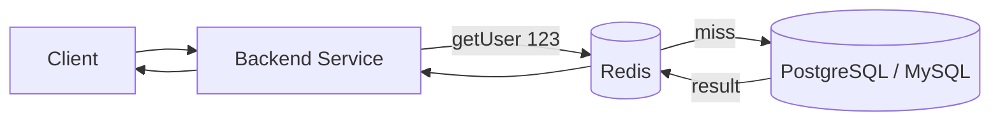

## 1) Context: why this exists

Every backend eventually reaches the same embarrassing moment: the database is fine in theory, but in practice it’s screaming in slow motion under read load.

You start seeing:

- API latency graphs slowly creeping up.
- DB CPU constantly above 70–80%.
- Occasional timeouts during traffic spikes.
- Product people asking “can we just make it faster?”

Most tutorials say “add Redis, profit”. They rarely answer:

- What exactly should you cache?
- How do you keep cache and database consistent?
- What happens when Redis dies or restarts?
- How do you avoid turning your cache into a second source of truth?

This post walks through a realistic setup: a typical backend (Java or Node, doesn’t matter much) using Redis as a read cache on top of a relational database, with enough structure that you can reason about it later, not just cargo-cult code snippets. :contentReference[oaicite:0]{index=0}

## 2) Architecture and mental model

At the highest level:

- Database: source of truth, slower, more expensive per query.
- Redis: fast, volatile memory layer sitting in front of the DB.
- Application: decides when to read/write cache vs DB.

Visualized:



Think of Redis as a **performance hint**, not a database:

- If Redis has the data: respond fast.
- If Redis doesn’t: go to DB, then optionally put result into Redis.
- If Redis is down: system should still work, just slower.

### Core mental model: cache-aside

The simplest and most common pattern:

1. Try cache first.
2. On cache miss, load from DB.
3. Store result in cache with TTL.
4. Return result.

Pseudocode:

```java
public User getUser(String userId) {
    String cacheKey = "user:" + userId;

    // 1) Try cache
    User cached = redis.get(cacheKey);
    if (cached != null) {
        return cached;
    }

    // 2) Fallback to DB
    User fromDb = userRepository.findById(userId);

    if (fromDb != null) {
        // 3) Fill cache with TTL
        redis.setex(cacheKey, Duration.ofMinutes(10).getSeconds(), serialize(fromDb));
    }

    return fromDb;
}
```

Key properties:

- Redis never becomes your source of truth.
- You can safely flush Redis and the system still works.
- Cache entries are **derived** from DB data, not independent information.

## 3) Step-by-step walkthrough

### 3.1) Decide what to cache

A few good default candidates:

- Expensive reads:
  - Heavy joins.
  - Aggregations (count, sum, statistics).
  - Views that hit multiple services.

- Hot keys:
  - Current user profile.
  - Home page data.
  - Frequently accessed reference data (feature flags, configuration).

- Data that tolerates slight staleness:
  - Product details.
  - Blog posts.
  - Leaderboards (last updated every few seconds).

Avoid caching:

- Highly volatile data that changes every few milliseconds (trades, ticks) unless carefully designed.
- Data requiring strict consistency (e.g. bank account balances) unless you have a strong consistency story.

### 3.2) Designing cache keys

Keys should be:

- Predictable.
- Namespaced.
- Safe to delete without regrets.

Common scheme:

```text
user:{userId}
product:{productId}
post:{postId}
user:recent-logins:{userId}
```

In code:

```java
private String userKey(String userId) {
    return "user:" + userId;
}
```

You can also add “versions”:

```text
user:v2:{userId}
```

So if you change schema or serialization format, you bump version and avoid colliding formats.

### 3.3) Choosing TTLs

TTL (time to live) is your “how stale can this be?” dial.

Rough heuristics:

- 5–30 seconds:
  - Leaderboards, trending items, metrics snapshots.

- 1–10 minutes:
  - User profile, product pages, detail screens.

- 1–24 hours:
  - Rarely changing reference data: configuration, feature flags, country codes.

Example:

```bash
SETEX user:123 600 "{...json...}"   # 600 seconds = 10 minutes
```

Trade-off:

- Short TTLs:
  - More load on DB.
  - Fresher data.

- Long TTLs:
  - Less DB load.
  - Risk of returning old data after update.

Many systems start with 5–10 minutes and adjust based on real traffic and complaints.

### 3.4) Read flow implementation (Java/Spring example)

Assume:

- `RedisTemplate<String, String>` wired.
- `UserRepository` for DB.

```java
@Service
public class UserService {

    private final RedisTemplate<String, String> redis;
    private final UserRepository userRepository;
    private final ObjectMapper objectMapper = new ObjectMapper();

    public UserService(RedisTemplate<String, String> redis,
                       UserRepository userRepository) {
        this.redis = redis;
        this.userRepository = userRepository;
    }

    public User getUser(String userId) {
        String key = "user:" + userId;

        // 1) Cache first
        String cachedJson = redis.opsForValue().get(key);
        if (cachedJson != null) {
            try {
                return objectMapper.readValue(cachedJson, User.class);
            } catch (Exception ignored) {
                // If deserialization fails, fall through to DB
            }
        }

        // 2) DB fallback
        User user = userRepository.findById(userId)
                                  .orElse(null);

        if (user != null) {
            // 3) Populate cache with TTL
            try {
                String json = objectMapper.writeValueAsString(user);
                redis.opsForValue().set(key, json, Duration.ofMinutes(10));
            } catch (Exception ignored) {
                // Log in real code
            }
        }

        return user;
    }
}
```

Key idea: cache failures must not break the main path; worst case, you hit the DB.

### 3.5) Write path: invalidate or update?

Two main options when the underlying data changes.

#### Option A: cache invalidation

On update:

1. Write to DB.
2. Delete relevant cache keys.

Example:

```java
public void updateUser(UserUpdateRequest request) {
    User user = userRepository.save(request.toEntity());

    String key = "user:" + user.getId();
    redis.delete(key); // let next read repopulate
}
```

Pros:

- Simple mental model: DB is truth, cache is throwaway.
- No need to update all representations if you miss some; they just expire.

Cons:

- Next read after update is a cache miss (slower).
- If you have multiple cache keys representing same entity, you must remember all of them.

#### Option B: write-through (update cache immediately)

After DB write, also update cache:

```java
public void updateUser(UserUpdateRequest request) {
    User user = userRepository.save(request.toEntity());

    String key = "user:" + user.getId();
    try {
        String json = objectMapper.writeValueAsString(user);
        redis.opsForValue().set(key, json, Duration.ofMinutes(10));
    } catch (Exception ignored) {}
}
```

Pros:

- Next read hits cache with fresh data.
- Better UX for hot keys.

Cons:

- More code paths writing to cache.
- Still need to handle failures (e.g. DB write success, Redis write fails).

Pragmatic pattern in many systems:

- For simple entities: prefer invalidation (less to reason about).
- For extremely hot keys where latency is critical: consider write-through.

## 4) Failure stories and gotchas

### 4.1) Cold start / cache warm-up

Symptom:

- After deploy or Redis flush, API latency spikes.
- DB CPU jumps because everything is cache-miss.

Root cause:

- Cache-aside means Redis only fills when requests come in. First wave of traffic pays the cost.

Mitigations:

- Pre-warm critical keys:
  - At deploy, call internal endpoint to load top N items into cache.

- Use higher capacity / better indexes in DB to survive warm-up periods.

### 4.2) Cache stampede (dogpile problem)

Symptom:

- A very hot key expires.
- Thousands of requests hit at once.
- All miss cache, all go to DB, DB dies a little inside.

Mitigations:

- Add **jitter** to TTLs:
  - Instead of `600s`, use `random(540..660)` to avoid synchronized expiry.

- Use lock or “single flight” around recomputation:
  - First request recomputes and sets cache.
  - Others wait briefly or serve slightly stale data.

Simplified pseudo:

```java
public String getCachedExpensiveValue() {
    String key = "expensive";

    String value = redis.get(key);
    if (value != null) return value;

    // Poor man's lock: try set a lock key with short TTL
    boolean lockAcquired = redis.setIfAbsent("lock:" + key, "1", 5, SECONDS);

    if (!lockAcquired) {
        // Someone else is recomputing; either:
        // - return stale value if you keep a backup
        // - or sleep briefly and try again
        return fallbackOrRetry();
    }

    try {
        String fromDb = computeExpensiveValue();
        redis.setex(key, 600, fromDb);
        return fromDb;
    } finally {
        redis.del("lock:" + key);
    }
}
```

Not perfect, but often good enough for internal systems.

### 4.3) Redis as “accidental database”

Failure pattern:

- Team starts putting “small” configs and flags only in Redis.
- No backup, no external representation.
- One day Redis data is wiped.
- Nobody remembers what the previous values were.

Rule:

- If losing Redis contents would cause downtime because you have no idea what to restore: that data belongs in a database or config repository, not only in Redis.

### 4.4) Oversized values and serialization pain

Common issues:

- Storing huge JSON blobs for things you rarely need.
- Serializing/deserializing with different schemas over time.
- High network overhead because “just throw the whole object in there”.

Mitigations:

- Cache only what you read:
  - Instead of full `User`, maybe cache `UserProfileView` with only relevant fields.

- Use versioned schemas:
  - `user:v2:{id}` and keep v1 decoding around for a while if needed.

- Monitor payload sizes:
  - Redis memory usage and network traffic will tell you when you’re being sloppy.

## 5) Results and trade-offs

What you typically gain after adding Redis caching sanely:

- Huge reduction in DB read load for hot endpoints.
- More stable p95/p99 latency.
- Headroom for traffic spikes and marketing campaigns.
- Ability to do heavier queries occasionally without melting the database.

What still sucks:

- Cache invalidation logic adds mental overhead.
- Bugs can hide behind stale data and appear “random”.
- You have one more moving piece in your architecture:
  - Redis down → system still works but slower.
  - Redis misconfigured (no eviction, no persistence understanding) → surprise outages.

When this approach is a good idea:

- Your workload is read-heavy, write-light.
- Data can tolerate small staleness.
- DB is your bottleneck, not something else (e.g., third-party API).

When to be careful or avoid:

- Strongly consistent financial or transactional data where stale reads are unacceptable without very deliberate design.
- Ultra low-latency systems where the bottleneck is CPU or algorithm, not IO.
- Teams with no observability:
  - Adding caching without metrics is just adding invisible complexity.

Pragmatic summary:

- Start with cache-aside + invalidation.
- Keep TTLs moderate.
- Treat Redis as an optimization layer you can wipe without losing business data.

## 6) References and further reading

- Redis documentation: Caching patterns and examples.
- “Caching in the Distributed World” style articles from major cloud providers (AWS, GCP, Azure) for conceptual overviews.
- Posts on cache stampede / dogpile problems for more advanced mitigation techniques.
- Source code of popular frameworks’ cache abstractions (Spring Cache, Django cache, etc.) for real-world patterns.
