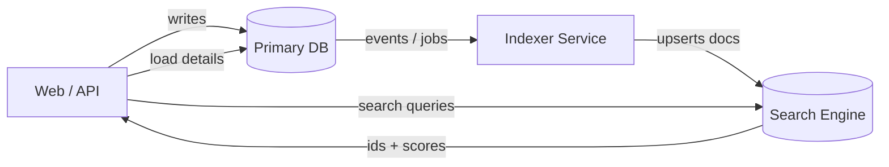

## 1. Context: the illusion of the innocent search box

At some point you add a search box.

At first it is “just a filter”: search blog posts by title, find users by email, filter logs by message. A quick `WHERE title LIKE '%query%'` and you ship it.

Then:

- Someone searches for `deploy` and expects `deployment` and `re-deploy` to show up.
- Another user types `SFTP connection` and the result they want is buried on page 3.
- Your table grows from 10k rows to a few million and suddenly searches spike CPU on your database.

The search box is no longer innocent. It’s a tiny UI wrapper around a surprisingly deep topic: information retrieval.

This post is my mental model for “searching by text” in real systems: what options exist, how they scale, and when to move from naive approaches to proper search infrastructure. I’ll walk through the main patterns, trade-offs, and common traps, rather than every possible tool. :contentReference[oaicite:0]{index=0}

---

## 2. Mental model: bags of words and lookup tables

Strip all the frameworks away and text search is just:

- A collection of documents (blog posts, tickets, products, logs).
- A query (whatever the user types).
- A scoring function that says “how relevant is this document to this query”.

Two key ideas:

1. **Tokenization**

   Convert text into tokens (words or subwords):
   - `"Searching by text is fun"` → `["search", "text", "fun"]` (after lowercasing, stemming, ignoring stopwords).
   - Query `"text search"` → `["text", "search"]`.

   Every search system must do some variant of this, even if you pretend you are just using `%LIKE%`.

2. **Inverted index**

   Databases are great at “row → fields”.
   Search needs “token → list of documents”.

   Conceptually:

   ```text
   "search" → [doc1, doc7, doc42]
   "text"   → [doc1, doc5]
   "fun"    → [doc1, doc99]
   ```

````

Search then looks up query tokens and combines the lists with some scoring formula (TF-IDF, BM25, custom weights, etc).

In practice, most solutions you’ll meet are built around:

* “Fake it” without an explicit inverted index (SQL LIKE).
* “Built-in inverted index” (database full-text search).
* “Dedicated inverted index engine” (Elasticsearch, OpenSearch, Meilisearch).
* “Embedding space” (vector search) with an optional inverted index on top.

---

## 3. The design space: four levels of text search

### 3.1 Level 0: naive substring search (LIKE, ILIKE, regex)

Pattern:

```sql
SELECT *
FROM posts
WHERE title ILIKE '%' || :query || '%';
````

When this is acceptable:

- Table is small (say ≤ 100k rows) and not growing rapidly.
- Only one or two columns to search.
- You can live without stemming, ranking, or typo tolerance.
- Traffic is low, or searches are rare compared to normal queries.

How it works:

- Database scans rows, checks each value for substring match.
- With indexes you can optimize prefix matches (`'query%'`), but wildcards on both sides (`'%query%'`) usually force a full scan.

Pros:

- Trivial to implement.
- No new infra.
- Predictable behavior.

Cons:

- Does not understand language. `"deploy"` ≠ `"deployment"`.
- No ranking beyond whatever `ORDER BY` you manually specify.
- Performance degrades linearly with data size.
- Hard to extend: phrase searches, weights, or multi-field ranking become painful.

Heuristic: this is fine for admin tools and internal dashboards. For user-facing search, it is a temporary band-aid.

---

### 3.2 Level 1: database full-text search

Most serious databases have text search built in:

- PostgreSQL: `tsvector`, `tsquery`, `to_tsvector`, `to_tsquery`.
- MySQL/MariaDB: `FULLTEXT` indexes, `MATCH ... AGAINST`.
- SQL Server: `FULLTEXT INDEX` and `CONTAINS`.

Example in PostgreSQL:

```sql
-- 1. Add a tsvector column and index
ALTER TABLE posts
ADD COLUMN search_vector tsvector GENERATED ALWAYS AS (
  to_tsvector('simple',
    coalesce(title, '') || ' ' || coalesce(content, '')
  )
) STORED;

CREATE INDEX idx_posts_search_vector ON posts USING GIN (search_vector);

-- 2. Query it
SELECT id, title, ts_rank(search_vector, plainto_tsquery('text search')) AS rank
FROM posts
WHERE search_vector @@ plainto_tsquery('text search')
ORDER BY rank DESC
LIMIT 20;
```

What you get:

- Tokenization, stemming, stopwords out of the box.
- Index that maps tokens → matching rows.
- Ranking via built-in scoring (e.g., `ts_rank`).

Pros:

- No extra infrastructure.
- Strong consistency (index updates in the same transaction as data).
- Good performance for many use cases.
- Can weight fields differently (e.g., title > body).

Cons:

- Syntax is more complex than `LIKE`.
- Language features depend on database and dictionaries.
- Harder to add features like fuzzy matching, aggregations, or custom ranking logic.
- When you outgrow it, migration to a dedicated search engine can hurt.

This is usually the sweet spot for:

- Medium-sized apps.
- Backends that already lean heavily on PostgreSQL.
- Search that must be strongly consistent with the main data.

---

### 3.3 Level 2: dedicated search engine (Elasticsearch, OpenSearch, Meilisearch, Typesense)

Here you promote search to its own service.

Core idea:

- Database is your source of truth.
- Search engine holds a denormalized, indexed copy tuned for queries.
- You sync data from DB → search engine via change data capture, background jobs, or event stream.

High-level architecture:



What you gain:

- Rich query language: full-text, filters, aggregations.
- Ranking and scoring tuned per index.
- Per-field analyzers (tokenization) for different languages.
- Fuzzy search, synonyms, autocomplete, “did you mean”.
- Horizontal scalability.

What you pay:

- Extra infrastructure: cluster, backups, monitoring.
- Data duplication and eventual consistency.
- An indexing pipeline to maintain and debug.

Typical pattern for a search API:

1. User sends query plus filters (`q=deploy&tag=sftp&page=1`).
2. Backend queries search engine with the query and filters.
3. Search engine returns document IDs and scores.
4. Backend loads detailed records from DB (optional) and returns them.

This level is appropriate when:

- You have multiple types of search (products, articles, logs, metrics).
- You need features like synonyms, fuzziness, or advanced aggregations.
- Search is critical to your product and has significant traffic.

---

### 3.4 Level 3: semantic / vector search

Keyword search operates on tokens. Semantic search operates on meaning.

Idea:

- Use an embedding model (often a transformer) to turn text into a vector in high-dimensional space, e.g. 768-D.
- Similar texts have vectors that are close under some distance (cosine, dot product, etc).
- Store these vectors in a vector database or ANN (approximate nearest neighbor) index (FAISS, HNSW, Pinecone, Qdrant, pgvector, etc).
- At query time, embed the query and fetch nearest neighbors.

This handles:

- Synonyms and paraphrases: `“crash on start”` can match `“app fails to launch”`.
- Long-tail queries where exact token overlap is low.
- Multi-language scenarios when using multilingual models.

However:

- Relevance is less interpretable; no obvious “why did this match” from tokens.
- Pure vector search can perform poorly on very short queries like “SFTP port”.
- Harder to combine structured filters unless the database supports hybrid queries.

In practice, strong systems combine:

- **Keyword search** for precise constraints and filters.
- **Vector search** for semantic similarity and reranking.

Example hybrid flow:

1. Use keyword search to retrieve candidate documents.
2. Re-rank top N candidates with a vector similarity score.
3. Optionally, use LLMs to rerank again or generate snippets.

---

## 4. Example architecture: evolving your search stack

A realistic evolution for a backend:

```mermaid
flowchart TD
  subgraph Phase0[Phase 0: MVP]
    DB0[(DB)]
    App0[App]
    App0 -->|LIKE / ILIKE| DB0
  end

  subgraph Phase1[Phase 1: DB Full-Text]
    DB1[(DB + FTS Index)]
    App1[App]
    App1 -->|FTS queries| DB1
  end

  subgraph Phase2[Phase 2: Search Engine]
    DB2[(DB)]
    Search2[(Search Engine)]
    Indexer2[Indexing Jobs]
    App2[App]
    App2 --> DB2
    DB2 --> Indexer2
    Indexer2 --> Search2
    App2 -->|search| Search2
  end

  subgraph Phase3[Phase 3: Hybrid (Keyword + Vectors)]
    DB3[(DB)]
    Search3[(Search Engine + Vectors)]
    Embedder3[Embedding Service]
    App3[App]
    App3 --> DB3
    DB3 --> Indexer3[Indexing Jobs]
    Indexer3 --> Embedder3
    Embedder3 --> Search3
    App3 -->|search + filters| Search3
  end
```

Key design decisions at each phase:

- Do you accept eventual consistency between DB and search?
- Where do you handle ranking tweaks (code vs config)?
- Who owns the schema of search documents (backend team, data team, separate “search team”)?

---

## 5. Failure stories and gotchas

Some common mistakes that show up once you go beyond `%LIKE%`:

1. **Ignoring language specifics**
   - Tokenization and stemming are language dependent.
   - Default analyzers may be tuned for English; Vietnamese, Japanese, or non-Latin scripts need their own analyzers.
   - Mixed-language content is common; plan indexes accordingly.

2. **Stopwords and empty queries**
   - Words like “the”, “a”, “and” are often removed by analyzers.
   - Queries that are only stopwords can become empty and match everything or nothing.
   - Good UX usually rewrites or rejects such queries explicitly.

3. **Relevance drift**
   - You add new fields to the index but forget to adjust field weights.
   - Suddenly description matches outrank title matches.
   - Relevance tuning becomes an ongoing task, not a one-time setup.

4. **Index bloat**
   - Index grows faster than expected because you index large blobs (raw HTML, logs with repeated boilerplate, etc).
   - You forget to clean up old versions or deleted docs.
   - Monitoring index size and pruning policies becomes necessary.

5. **Eventual consistency surprise**
   - User creates or edits content and immediately searches for it.
   - With async indexing, the result is missing for a few seconds/minutes.
   - You may need read-your-writes workarounds: for example, merge DB results with search results for the current user’s recent changes.

6. **Security filters in search**
   - If permissions are implemented as filters in search queries, any bug in filter construction can leak data.
   - Safer pattern: bake per-tenant / per-project visibility into indexed documents and defensive filters.

---

## 6. Choosing the right level for your system

Short heuristic:

- Use **LIKE/ILIKE** for:
  - Internal tools and low-traffic admin panels.
  - Quick experiments where correctness matters more than fuzziness.

- Use **database full-text search** when:
  - Your database is PostgreSQL or similar with good FTS.
  - Search is important but not yet a separate product feature.
  - You want consistent, transactional updates.

- Use a **dedicated search engine** when:
  - Search is a core feature for users.
  - You need filters, aggregations, fuzziness, autocomplete.
  - You can afford operating extra infra.

- Add **vector / semantic search** when:
  - Queries are messy, natural language, and long.
  - You care about semantic similarity more than exact terms.
  - You are already comfortable running ML models and vector stores.

This is not a ladder you must climb; it is a toolbox. Plenty of successful products stop at Level 1 or Level 2 and never touch vectors. Others jump straight into hybrid search because their domain is inherently fuzzy (support tickets, knowledge bases, code search).

---

## 7. References and further reading

- Manning, Raghavan, Schütze – _Introduction to Information Retrieval_ (free online).
- PostgreSQL docs: “Full Text Search”.
- MySQL manual: “Full-Text Search Functions”.
- Elasticsearch / OpenSearch: “Inverted Index”, “Analyzers”.
- Papers and blog posts on BM25 and ANN indexes (FAISS, HNSW).
- Any serious postmortem from teams that had to re-build their search relevance from scratch.
