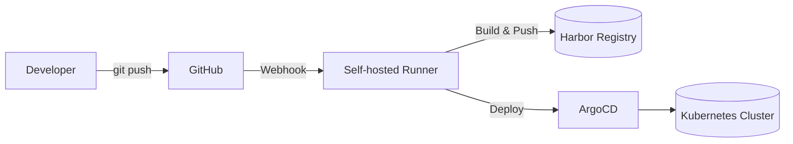

# Sample guideline for writing blog posts on minhdq.dev

## 1. Purpose and audience

- Write for intermediate–advanced developers who already know basics and are curious about how things really work.
- Assume readers can read docs; the blog exists to show:
  - How you actually used a technology.
  - Trade-offs, failure stories, weird edge cases.
  - Mental models and architectures, not just snippets.

## 2. Standard post structure

Use this skeleton for most posts.

```md
---
title: 'Clear, specific title with tech and outcome'
description: '1–2 sentence summary of problem and result'
tags: [kubernetes, homelab, devops]
---

## 1. Context: why this exists

Short story:

- What problem you faced.
- Why existing tutorials were not enough.
- Constraints (self-hosted, limited budget, weird infra, etc).

## 2. Architecture and mental model

- High-level explanation.
- Mermaid diagram.
- Key design decisions.

## 3. Step-by-step walkthrough

- Concrete steps with commands, configs, code.
- Short explanations inline.
- Mention alternatives and why you skipped them.

## 4. Failure stories and gotchas

- What broke, how you debugged it.
- Logs, symptoms, and root cause.
- Final fix.

## 5. Results and trade-offs

- What improved and what still sucks.
- When this approach is a good idea.
- When to avoid it.

## 6. References and further reading

- Official docs.
- Specs, RFCs, or repos you actually used.
```

## 3. Tone and voice

- Default tone: relaxed, mildly sarcastic, but never dismissive of the reader.
- Be professional on technical content:
  - Clear definitions.
  - Explicit assumptions.
  - Honest about unknowns and guesses.

- Use humor on:
  - Section intros.
  - Failure stories.
  - Metaphors and analogies.

- Avoid:
  - Forced jokes every paragraph.
  - Mocking people; mock systems, design mistakes, or your past self instead.

Example tone:

> Proxmox and ZFS are great until you realize you clicked “Next” four times and now have no idea what the installer did to your disks. This post is about unrolling that chaos into something you can reason about.

## 4. Examples, stories, and “narrative spine”

Every post must contain at least one of:

- A real incident from your homelab or work.
- A concrete project (service, cluster, CI pipeline, etc.).
- A before/after comparison.

Good pattern:

1. Start with a small story:
   - “I needed a multi-tenant k8s cluster on my homelab because…”

2. Move to general principle:
   - “This leads to three constraints any home k8s cluster hits…”

3. Show implementation:
   - Configs, scripts, manifests.

4. Close with reflection:
   - “Next time I’d probably do X differently.”

## 5. Diagrams and visual elements

### 5.1 Mermaid diagrams

- Use Mermaid for:
  - Architecture diagrams.
  - Sequence flows (e.g., CI/CD pipeline).
  - State machines or data flow.

Example:



Rules:

- Always label nodes with both role and example (e.g., `Harbor Registry`, `ws01`).
- Prefer 1–2 diagrams per post rather than a huge complex one.

### 5.2 Code blocks and configs

- Use fenced code blocks with language tags:

```bash
# Good
kubectl get pods -n argocd

# Bad
kubectl get pods  # what namespace? what context?
```

- Shell:
  - Prefix commands with a comment to set context (`# on ws01`, `# inside nfs01 LXC`).

- Config:
  - Show minimal working configs, then optional extended version.

### 5.3 Visual arts

- Use visuals when:
  - The concept is spatial (networks, clusters, backup flows).
  - The explanation needs a timeline (incident postmortem).

- Acceptable visual formats:
  - Mermaid.
  - Screenshots with annotations (blur secrets).
  - Simple tables showing comparison, before/after, etc.

## 6. Formatting and style conventions

- Headings:
  - Numbered main sections: `## 1. Title`, `## 2. Title`, etc.
  - No emojis in headings.

- Paragraphs:
  - Short, 2–4 sentences.

- Lists:
  - Use bullet lists for steps, gotchas, and trade-offs.

- Code:
  - Prefer realistic values over placeholders.
  - When using placeholders, name them clearly: `{{DOMAIN}}`, `{{CLUSTER_NAME}}`.

- Language:
  - Consistent language within one post (English or Vietnamese), unless explicitly bilingual.

- Links:
  - External docs: link to the canonical source (official docs, spec, main repo).
  - No naked `drive.google.com` links; wrap in text or avoid entirely if conflicting with your existing rule set.

## 7. Technical rigor

- Every non-trivial claim should have one of:
  - A log snippet.
  - A benchmark or measurement.
  - A link to official docs/spec.

- Clearly mark:
  - Opinion: “In my experience…”
  - Fact: “According to the docs…”

- When you are unsure:
  - State that it is a hypothesis, not a fact.

---

Additional information needed to refine this guideline

- Primary audience focus: homelab builders, backend engineers, DevOps/SRE, or mixed.
- Do not focus too much on coding tutorials; prefer architecture, design, and postmortems.
- Default language for most posts: English, Vietnamese, or split by topic.
- Preferred post length: short notes, deep dives, or both with different labels.
- Category structure: e.g., `homelab`, `kubernetes`, `aws`, `productivity`, `meta`.
- Tech stack to prioritize: specific tools and platforms you want to write about more often.
- Policy for code and secrets: how you want to handle redaction, sample repos, and gists.
- SEO preferences: title format, URL slugs, meta description rules, and whether to care about keywords at all.
- Reuse rules: whether diagrams and configs should be extracted into a shared `/snippets` or `/diagrams` folder for reuse across posts.
